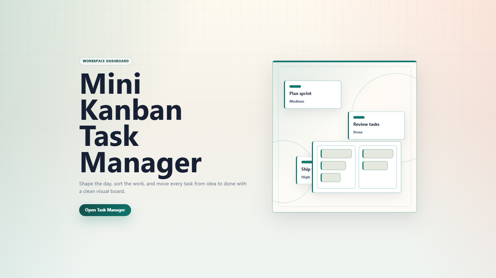
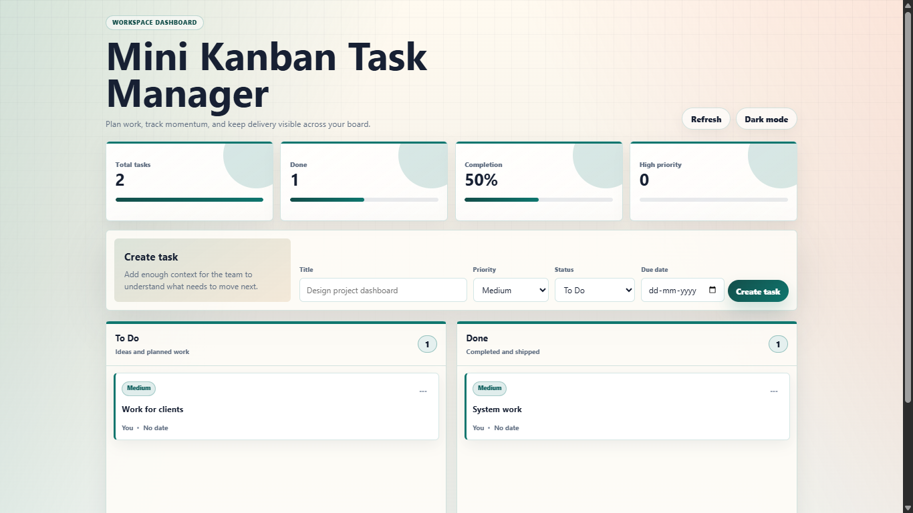
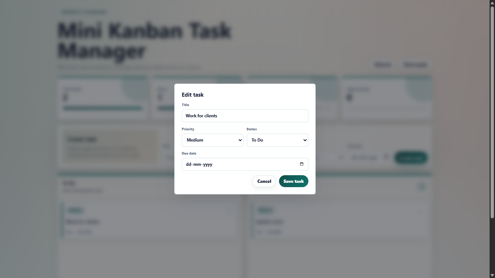
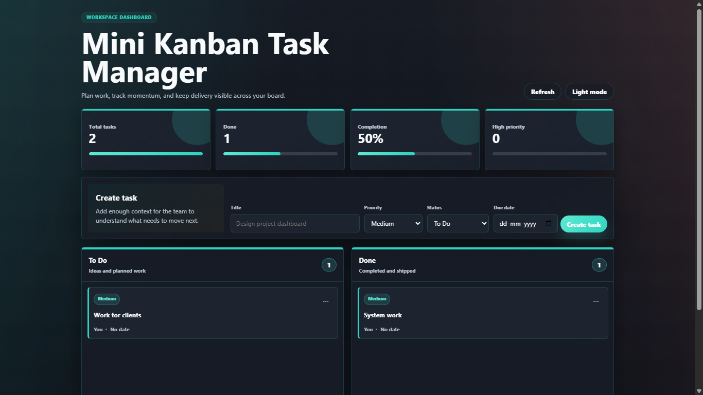

# Mini Kanban Task Manager

A focused full-stack Kanban task manager for planning small workflows, tracking task status, and moving work from `To Do` to `Done`. The app is built with React 19, Vite, Express, and Vercel-compatible serverless API routes.

The current implementation includes a polished landing screen, responsive task dashboard, task analytics, drag-and-drop status changes, editable task cards, delete confirmation, validation, toast feedback, and light/dark themes.

---

## Review Checklist

Use this checklist to review the delivered app against the README and product brief.

### Product experience

- [ ] Landing screen shows the product name and an `Open Task Manager` action.
- [ ] Opening the board transitions from the landing screen into the dashboard.
- [ ] Dashboard header includes refresh and theme toggle actions.
- [ ] Light mode and dark mode both render correctly.
- [ ] Layout is responsive on desktop, tablet, and mobile widths.
- [ ] Empty columns show a clear empty state.
- [ ] Loading and error states are visible when API requests are in progress or fail.
- [ ] Success toasts appear after create, update, move, and delete actions.

### Task management

- [ ] User can create a task with title, priority, status, and due date.
- [ ] Empty task titles are rejected with a validation message.
- [ ] User can create tasks directly into either `To Do` or `Done`.
- [ ] Task cards display title, priority, assignee, and formatted due date.
- [ ] Task cards show `No date` when no due date is provided.
- [ ] User can move a task between columns from the card actions menu.
- [ ] User can drag and drop a task between columns.
- [ ] User can edit task title, priority, status, and due date.
- [ ] User can delete a task only after confirming the delete dialog.
- [ ] Disabled form states appear while create/edit requests are saving.

### Dashboard analytics

- [ ] Total task count updates when tasks are added or deleted.
- [ ] Done task count updates when task status changes.
- [ ] Completion percentage updates from the current board data.
- [ ] High-priority task count updates when task priority changes.
- [ ] Progress bars visually reflect the current analytics values.

### API behavior

- [ ] `GET /api/tasks` returns all tasks.
- [ ] `POST /api/tasks` creates a valid task.
- [ ] `GET /api/tasks/:id` returns one task in the Vercel API route.
- [ ] `PATCH /api/tasks/:id` updates one or more task fields.
- [ ] `PUT /api/tasks/:id` is supported by the API handlers.
- [ ] `DELETE /api/tasks/:id` removes a task and returns `204`.
- [ ] Invalid task IDs return `400`.
- [ ] Missing tasks return `404`.
- [ ] Unsupported methods return `405` with an `Allow` header.
- [ ] Invalid status, priority, due date, or empty title returns `400`.

### Production readiness

- [ ] `npm install` completes successfully.
- [ ] `npm run dev` starts both the Vite client and Express API.
- [ ] `npm run build` creates the production build in `dist/`.
- [ ] `npm run preview` serves the production build locally.
- [ ] Vercel rewrites are configured for `/tasks/:path*` to `/api/tasks/:path*`.
- [ ] README limitations are understood before exposing this publicly.

---

## Features

- **Two-column Kanban board** with `To Do` and `Done` workflows.
- **Landing experience** with animated board artwork and a clear entry action.
- **Task creation form** for title, priority, status, and due date.
- **Task editing dialog** for updating existing task details.
- **Delete confirmation dialog** to reduce accidental removals.
- **Drag-and-drop movement** between columns.
- **Card action menu** for status changes, editing, and deleting.
- **Dashboard analytics** for total tasks, done tasks, completion percentage, and high-priority tasks.
- **Manual refresh** action to reload task data from the API.
- **Toast notifications** for successful create, update, move, and delete flows.
- **Validation feedback** for empty titles, invalid status, invalid priority, invalid dates, invalid IDs, and missing records.
- **Light/dark theme toggle** with responsive styling.
- **Responsive UI** for desktop, tablet, and mobile screens.
- **Accessible UI basics** including semantic sections, dialog roles, labels, button states, alerts, and status messages.
- **Local Express API** for development.
- **Vercel serverless API routes** for hosted deployments.

---

## Demo Assets

The repository includes demo media in `public/`.

### Screenshots









### Demo Video

[Watch the demo video](public/demo_v.mp4)

### Asset List

- Screenshot: `public/demo_1.png`
- Screenshot: `public/demo_2.png`
- Screenshot: `public/demo_3.png`
- Screenshot: `public/demo_4.png`
- Demo video: `public/demo_v.mp4`
- Favicon: `public/favicon.png`

---

## Tech Stack

| Layer | Technology |
| --- | --- |
| Frontend | React 19, Vite 7 |
| Backend | Node.js, Express 5 |
| Serverless API | Vercel Node functions in `api/tasks` |
| Styling | Plain CSS with responsive media queries |
| Data transport | REST over JSON |
| Dev tooling | Concurrently, npm scripts |

---

## Prerequisites

- Node.js 18 or newer
- npm 9 or newer

Check local versions:

```bash
node --version
npm --version
```

---

## Getting Started

Install dependencies:

```bash
npm install
```

Start the local development environment:

```bash
npm run dev
```

This starts both services:

| Service | URL |
| --- | --- |
| Vite frontend | `http://127.0.0.1:5173` |
| Express API | `http://localhost:3001` |

The Vite dev server proxies `/api/tasks` requests to the local Express API.

---

## Production Build

Create a production build:

```bash
npm run build
```

Preview the production build locally:

```bash
npm run preview
```

The built frontend is emitted to `dist/`.

For the standalone Express server, `server/index.js` serves static files from `dist/` and exposes the API under `/api`.

---

## Deployment Notes

### Vercel

This project includes Vercel-compatible API handlers:

```text
api/tasks/index.js
api/tasks/[id].js
api/tasks/data.js
```

`vercel.json` rewrites `/tasks/:path*` to `/api/tasks/:path*`.

### Express

The local Express server mirrors the task API for development and can serve the production build after `npm run build`.

Default Express port:

```text
3001
```

Override with:

```bash
PORT=4000 npm run server
```

On Windows PowerShell:

```powershell
$env:PORT=4000
npm run server
```

---

## Project Structure

```text
mini-kanban-task-manager/
|-- api/
|   `-- tasks/
|       |-- [id].js        # Vercel handler for single-task read/update/delete
|       |-- data.js        # In-memory task store for serverless handlers
|       `-- index.js       # Vercel handler for list/create
|-- public/
|   |-- demo_1.png
|   |-- demo_2.png
|   |-- demo_3.png
|   |-- demo_4.png
|   |-- demo_v.mp4
|   `-- favicon.png
|-- server/
|   `-- index.js           # Local Express API and static production server
|-- src/
|   |-- App.jsx            # React app, task flows, dialogs, board, analytics
|   |-- main.jsx           # React entry point
|   `-- styles.css         # App styling, themes, responsiveness, animations
|-- index.html
|-- package.json
|-- vercel.json
`-- vite.config.js
```

---

## Available Scripts

| Script | Description |
| --- | --- |
| `npm run dev` | Starts Express and Vite together. |
| `npm run server` | Starts only the Express API/static server. |
| `npm run client` | Starts only the Vite frontend dev server. |
| `npm run build` | Builds the React app for production. |
| `npm run preview` | Previews the Vite production build locally. |

---

## API Reference

Base URL in local development:

```text
http://localhost:3001/api
```

The frontend calls the relative base path:

```text
/api/tasks
```

### Task Schema

```json
{
  "id": 1,
  "title": "Design project dashboard",
  "status": "todo",
  "priority": "medium",
  "dueDate": "2026-06-09",
  "assignee": "You",
  "createdAt": "2026-06-09T00:00:00.000Z"
}
```

Allowed statuses:

```text
todo, done
```

Allowed priorities:

```text
low, medium, high
```

### Endpoints

| Method | Endpoint | Description |
| --- | --- | --- |
| `GET` | `/api/tasks` | Return all tasks. |
| `POST` | `/api/tasks` | Create a task. |
| `GET` | `/api/tasks/:id` | Return one task. |
| `PATCH` | `/api/tasks/:id` | Partially update a task. |
| `PUT` | `/api/tasks/:id` | Update a task with provided fields. |
| `DELETE` | `/api/tasks/:id` | Delete a task. |

### Create Task

```http
POST /api/tasks
Content-Type: application/json
```

```json
{
  "title": "Prepare launch notes",
  "status": "todo",
  "priority": "high",
  "dueDate": "2026-06-15"
}
```

### Update Task

```http
PATCH /api/tasks/1
Content-Type: application/json
```

```json
{
  "status": "done"
}
```

### Error Responses

Common validation errors:

```json
{ "error": "Title must not be empty." }
```

```json
{ "error": "Task not found." }
```

```json
{ "error": "At least one task field is required." }
```

---

## Data Model and Persistence

Tasks are stored in memory.

Local Express data lives inside `server/index.js`.

Vercel serverless route data lives inside `api/tasks/data.js`.

This keeps the project lightweight for the Mini Kanban scope, but it means task data is not durable. Restarting the server or serverless runtime can reset tasks.

---

## Quality Notes

The implementation currently includes:

- Client-side validation for empty task titles.
- Server-side validation for task title, status, priority, due date, and ID.
- Optimistic UI update when moving a task between columns.
- Rollback on failed task move.
- Disabled controls during create/edit saving states.
- `role="alert"` for visible errors.
- `role="status"` for toast messages.
- Dialog semantics for edit and delete flows.
- Reduced-motion handling through `prefers-reduced-motion`.

Recommended next production hardening:

- Add persistent storage such as SQLite, PostgreSQL, or a hosted database.
- Add automated tests for API validation and core React task flows.
- Add authentication before public multi-user use.
- Add authorization/ownership rules if tasks become user-specific.
- Add request logging, monitoring, and rate limiting for public deployments.
- Share task data between local and serverless implementations through one common module if the app grows.

---

## Known Limitations

- **No durable persistence:** tasks are stored in memory.
- **No authentication:** the API is open.
- **Single-user model:** all tasks belong to the current runtime.
- **No real-time sync:** multiple browser sessions do not receive live updates.
- **No automated test suite yet:** behavior should be manually reviewed with the checklist above.

---

## Manual QA Flow

1. Run `npm run dev`.
2. Open `http://127.0.0.1:5173`.
3. Open the task manager from the landing page.
4. Create one low, one medium, and one high priority task.
5. Move a task to `Done` with drag and drop.
6. Move a task using the card action menu.
7. Edit a task title, priority, status, and due date.
8. Delete a task and confirm that the analytics update.
9. Toggle dark mode and light mode.
10. Refresh the board and verify data reloads from the API.
11. Resize to mobile width and verify forms, cards, dialogs, and actions remain usable.
